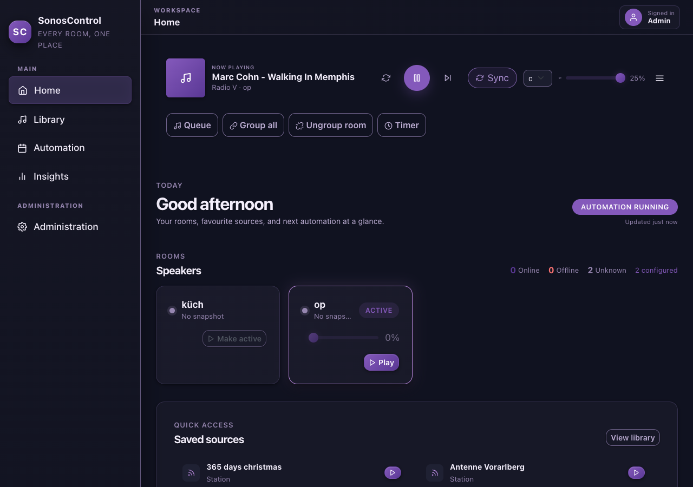
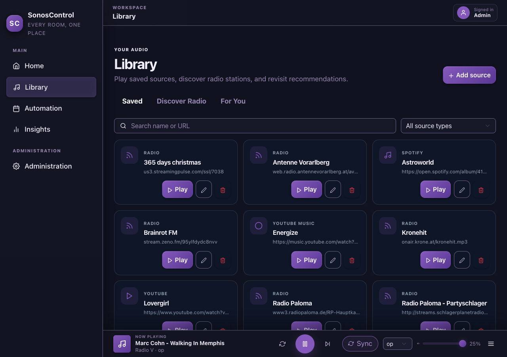
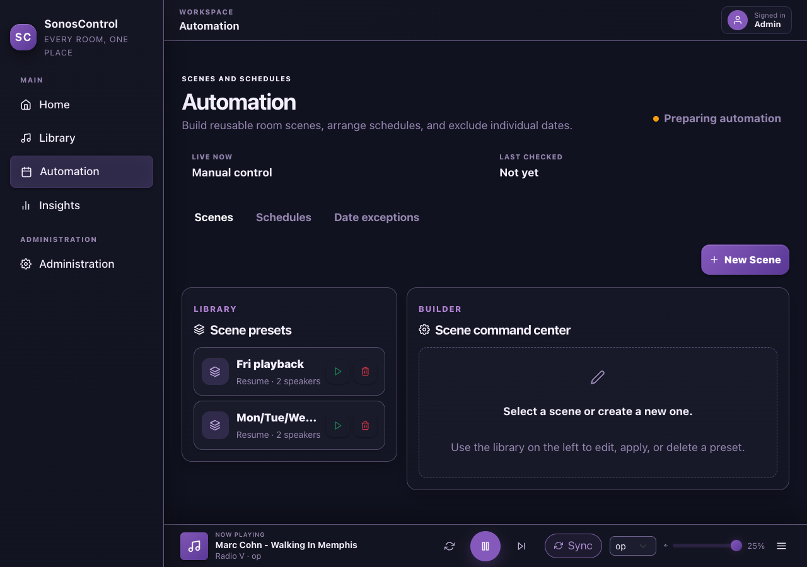
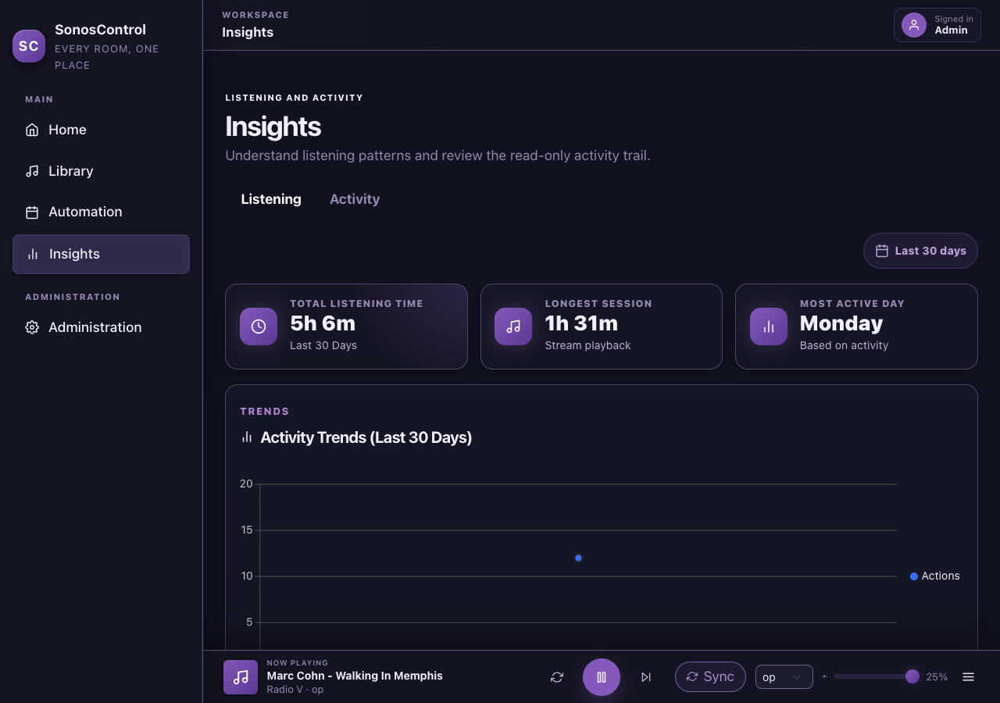
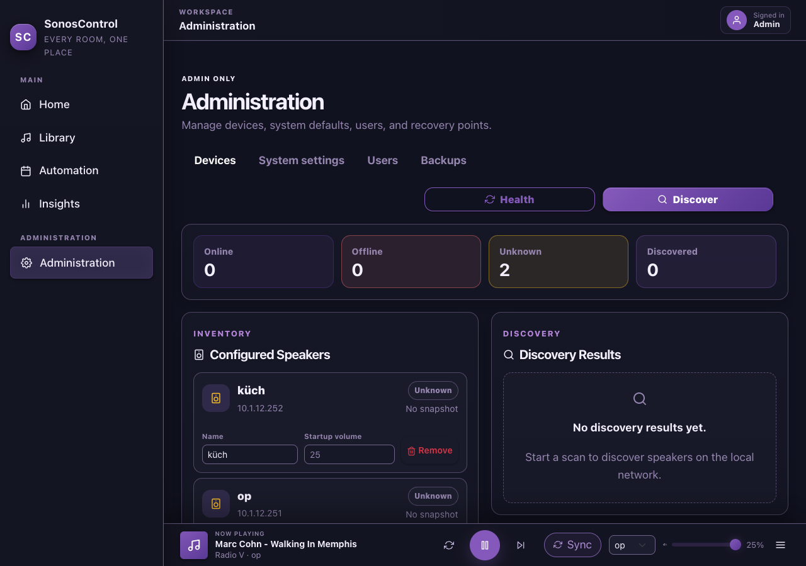
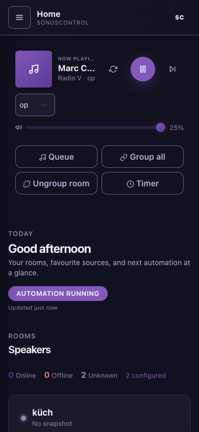
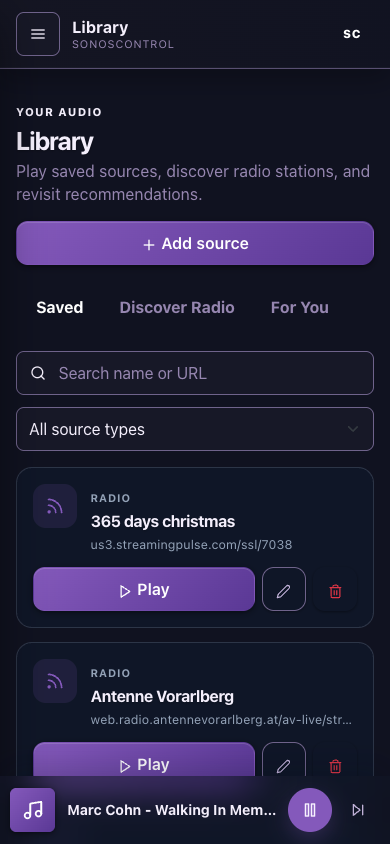
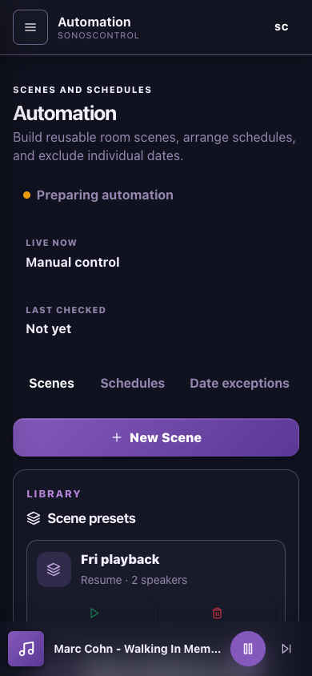
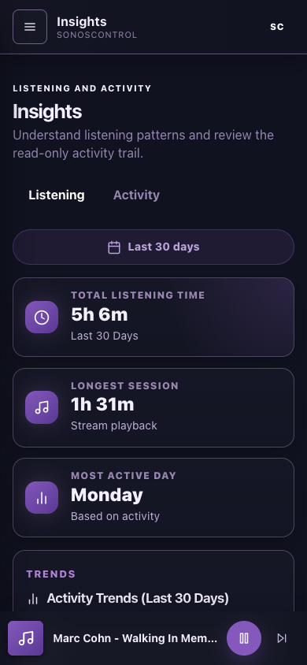
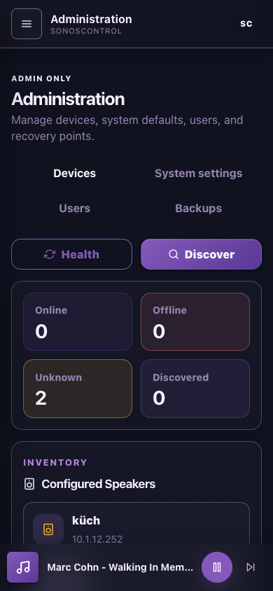

# SonosControl - Self-Hosted Sonos Automation Dashboard
[](https://github.com/Darkatek7/SonosControl/actions/workflows/dockerhubpush.yml)

SonosControl is a deployer-friendly Blazor control centre organised around everyday playback, a unified source library, scene-based automation, listening insights, and role-aware administration.



## Quick Start

### 1. Run with Docker Compose

```yaml
services:
  sonos:
    build:
      context: .
      dockerfile: Dockerfile
    image: sonoscontrol:local
    container_name: sonoscontrol
    restart: unless-stopped
    ports:
      - "8080:8080"
    environment:
      TZ: Europe/Vienna
      ADMIN_USERNAME: admin
      ADMIN_EMAIL: admin@example.com
      ADMIN_PASSWORD: ChangeMe123!
      PLAYBACK_PUBLIC_BASE_URL: http://192.168.1.50:8080
    volumes:
      - ./Data:/app/Data
      - ./DataProtectionKeys:/app/DataProtectionKeys
      - ./artifacts:/app/artifacts
```

```bash
cp .env.example .env
docker compose up -d --build
```

Open `http://localhost:8080` and sign in with the seeded admin account.
Set `PLAYBACK_PUBLIC_BASE_URL` to the LAN URL that your Sonos devices can reach. `localhost` does not work for YouTube audio streaming to Sonos.

### 2. Run locally with .NET 10

PowerShell:
```powershell
dotnet restore
Copy-Item SonosControl.Web/Data/config.template.json SonosControl.Web/Data/config.json -ErrorAction SilentlyContinue
dotnet run --project SonosControl.Web --urls http://localhost:5107
```

Bash:
```bash
dotnet restore
cp -n SonosControl.Web/Data/config.template.json SonosControl.Web/Data/config.json
dotnet run --project SonosControl.Web --urls http://localhost:5107
```

Then open `http://localhost:5107`.

## Screenshot Gallery

### Desktop

| Home | Library | Automation | Insights | Administration |
|---|---|---|---|---|
|  |  |  |  |  |

### Mobile

| Home | Library | Automation | Insights | Administration |
|---|---|---|---|---|
|  |  |  |  |  |

## Feature Highlights

- Expanded Home player plus a compact sticky mini-player with queue, room, group, sync, timer, and coalesced volume controls.
- One Library for saved TuneIn, Spotify, YouTube, and YouTube Music sources, Radio Browser discovery, and recommendations.
- Reusable scenes, ordered recurring schedules, date exceptions, fades, and migration from legacy day-based automation.
- Role-based access (`operator`, `admin`, `superadmin`) with registration control.
- Responsive listening statistics and a searchable read-only activity trail.
- Separate administration areas for devices, system settings, users, and recoverable configuration backups.
- Health and metrics endpoints (`/healthz`, `/metricsz`) for basic monitoring.
- Docker image includes `ffmpeg` and `yt-dlp` for YouTube audio playback without extra sidecars.

## Docs Index
- [Deploy and Config Guide](docs/deploy-and-config.md)
- [Docker Operations](docs/docker-operations.md)
- [Operations and Observability](docs/operations-and-observability.md)
- [Testing and Troubleshooting](docs/testing-and-troubleshooting.md)
- [Warning triage notes](docs/quality-warning-triage.md)
- [Contributing Guide](CONTRIBUTING.md)

## Contributing
Contribution workflow, README asset maintenance, and screenshot refresh instructions are documented in [CONTRIBUTING.md](CONTRIBUTING.md).

## License
SonosControl is released under the [Don't Be a Dick Public License](LICENSE.md).

## Useful Links
- Docker Hub: https://hub.docker.com/r/darkatek7/sonoscontrol
- ByteDev.Sonos: https://github.com/ByteDev/ByteDev.Sonos
- Radio Browser: https://www.radio-browser.info/
- ASP.NET Core docs: https://learn.microsoft.com/aspnet/core
